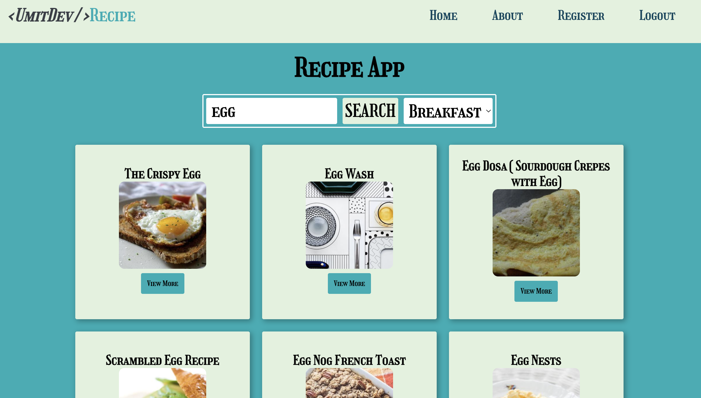
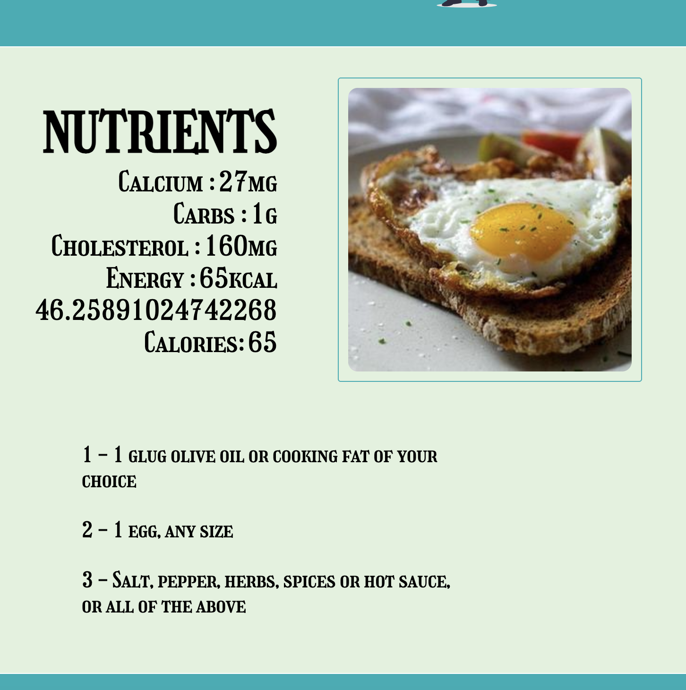

<p align="center">
  
  
  
  
  
  
</p>

<h1 align="center">📌 React Recipe App  </h1>

<p align="center">
A modern recipe discovery app with protected routes and third-party API integration.
</p>


<div align="center">
  <h3>
    <a href="https://recipe-app-umitdev.netlify.app/">
      🖥️ Demo
    </a>
     | 
    <a href="https://github.com/Umit8098/React-Project-Recipe-App.git">
      📂 Repository
    </a>
  </h3>
</div>

<p align="center">
  
</p>

## Navigation

- [✨ Overview](#-overview)
- [📖 Description](#-description)
- [🚀 Features](#-features)
- [🗂️ Project Skeleton](#️-project-skeleton)
- [🛠️ Built With](#️-built-with)
- [⚡ How To Use](#-how-to-use)
- [📌 About This Project](#-about-this-project)
- [🙏 Acknowledgements](#-acknowledgements)
- [📬 Contact](#-contact)


## ✨ Overview

<div align="center"> 

  
  
  --- 
  
   

  ---

</div>

- React Recipe App, kullanıcıların Edamam API aracılığıyla yemek tariflerini arayabileceği, detaylı besin değerlerini görüntüleyebileceği modern bir tarif uygulamasıdır.
- Kullanıcı girişi (login), özel sayfa koruması (Private Router) ve dinamik yönlendirme özellikleriyle birlikte geliştirilmiştir.


## 📖 Description

This project is a modern recipe search application built with React.

Users can search for recipes via the **Edamam Recipe API**, view detailed nutritional information, and navigate between protected and public pages using **React Router v6**.

The application demonstrates:
- API integration and data fetching with Axios
- Client-side routing with protected routes (PrivateRouter)
- Session-based authentication flow
- Responsive UI design using Styled Components


## 🚀 Features

- 🌐 API Integration with `https://api.edamam.com/api/recipes/v2`
- ⚛️ React Router v6 ile client-side routing
- 🔐 PrivateRouter ile korumalı sayfalar
- 🌐 Edamam Recipe Search API entegrasyonu
- 💅 Styled Components ile modern, responsive tasarım
- 💾 Session Storage ile kullanıcı oturum yönetimi
- 📱 Mobil uyumlu navbar ve hamburger menü
- 🚀 Deployed on Netlify
  


## 🗂️ Project Skeleton

```
src/
 │
 |----readme.md   
 │
 ├─ assets/
 │     ├─ coding.svg
 │     ├─ diet.svg
 │     └─ default-image.png
 │
 ├─ components/
 │   ├─ cards/
 │   │    ├─ Cards.jsx
 │   │    └─ Cards.style.jsx
 │   │
 │   ├─ globalStyles/
 │   │    ├─ Flex.jsx
 │   │    ├─ Global.styles.jsx
 │   │    └─ Theme.js
 │   │
 │   ├─ header/
 │   │    ├─ Header.jsx
 │   │    └─ Header.style.jsx
 │   │
 │   └─ nav/
 │        ├─ Navbar.jsx
 │        └─ Navbar.style.jsx
 │
 ├─ pages/
 │   ├─ about/
 │   │    ├─ About.jsx
 │   │    └─ About.style.jsx
 │   │
 │   ├─ detail/
 │   │    ├─ Detail.jsx
 │   │    └─ Detail.jsx
 │   │
 │   ├─ home/
 │   │    ├─ Home.jsx
 │   │    └─ Home.style.jsx
 │   │
 │   ├─ login/
 │   │    ├─ Login.jsx
 │   │    └─ Login.style.jsx
 │   │
 │   └─ register/
 │        └─ Registerjsx
 │
 ├─ router/
 │    ├─ AppRouter.jsx
 │    └─ PrivateRouter.jsx
 │   
 ├─ App.js
 └─ index.js
```


## 🛠️ Built With

- [⚛️ React](https://react.dev/)  
- [🧭 React Router v6](https://reactrouter.com/) 
- [💅 Styled Components](https://styled-components.com/) 
- [📦 Axios](https://axios-http.com/) 
- [🍴 Edamam Recipe API](https://developer.edamam.com/edamam-recipe-api) 
- [GitHub Pages](https://pages.github.com/) 
- [Netlify](https://www.netlify.com/) 

---

## ⚡ How To Use

To clone and run this application, you'll need [Git](https://git-scm.com/), [Node.js](https://nodejs.org/), and a package manager (`yarn` or `npm`) installed on your computer.

```bash
# Clone this repository
$ git clone https://github.com/Umit8098/React-Project-Recipe-App.git

# Navigate into the project folder
$ cd React-Project-Recipe-App

# Install dependencies
$ yarn  
$ yarn start

# or using npm
$ npm install
$ npm start
```
- Then open http://localhost:3000 to view it in your browser.


## 📌 About This Project

This project was developed to strengthen core React skills such as routing, API integration, and component-based architecture.

It focuses on:
- Implementing protected routes using React Router
- Managing authentication state with Session Storage
- Consuming a third-party REST API
- Building reusable and styled components
- Deploying a production-ready frontend application

The project reflects real-world frontend patterns commonly used in modern React applications.


## 🙏 Acknowledgements

- [🎓Clarusway](https://clarusway.com/) – for the training resources
- [📘React Documentation](https://react.dev/)
- [🧭React Router Docs](https://reactrouter.com/en/main/start/overview)
- [💅 Styled Components](https://styled-components.com/)
- [🍴 Edamam Recipe API](https://developer.edamam.com/edamam-recipe-api) 


## 📬 Contact

<!-- - Website [your-website.com](https://{your-web-site-link}) -->
- GitHub [@Umit8098](https://github.com/Umit8098)

- Linkedin [@umit-arat](https://linkedin.com/in/umit-arat/)
<!-- - Twitter [@your-twitter](https://{twitter.com/your-username}) -->
